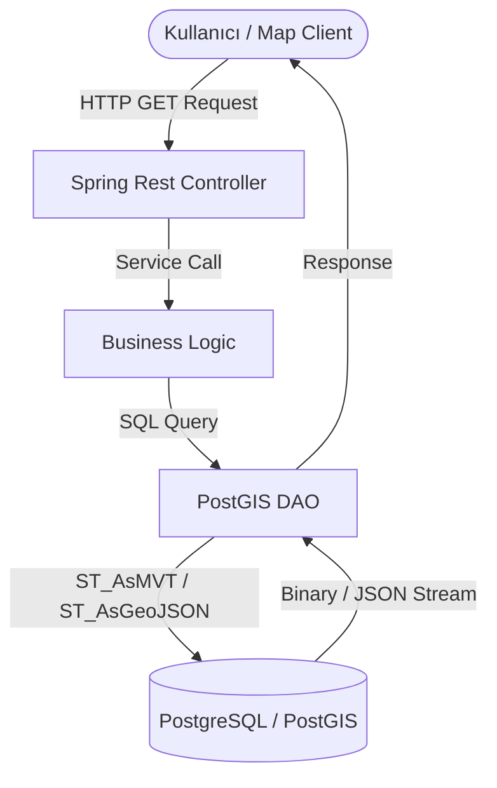

# 🌍 GeojsonServer: High-Performance Spatial Data Engine

[](https://spring.io/projects/spring-boot)
[](https://postgis.net/)
[](https://www.oracle.com/java/)
[](https://opensource.org/licenses/MIT)

> **Mekânsal Veri Yönetiminde Yeni Nesil Mimari.** Post-AI dünyasında verinin coğrafi bağlamı hiç olmadığı kadar kritik. **GeojsonServer**, karmaşık spatial query'leri milisaniyeler içinde işleyen, yüksek performanslı bir Spring Boot çözümüdür.

---

## 🚀 Proje Vizyonu

Bu proje, sadece veri sunan bir API değil; **PostGIS**, **GeoJSON** ve **MVT (Mapbox Vector Tiles)** teknolojilerini bir araya getiren hibrit bir mekânsal veri motorudur. Büyük veri setlerini (Big Data) harita üzerinde akıcı bir şekilde görselleştirmek için optimize edilmiştir.

### ✨ Öne Çıkan Özellikler

- 🛰️ **Native PostGIS Entegrasyonu**: Veritabanı seviyesinde `ST_AsGeoJSON` ve `ST_AsMVT` fonksiyonları ile maksimum hız.
- 📦 **MVT (Vector Tile) Desteği**: Harita altlıklarında binlerce noktayı tile tabanlı, hızlı yükleme ile sunma yeteneği.
- 🗺️ **Çok Katmanlı Destek**: Nokta (Point), Çizgi (LineString) ve Poligon (Polygon) geometrilerini default olarak destekler.
- 🔍 **Gelişmiş Spatial Query**: "Hangi noktalar bu poligonun içinde?" (Spatial Join) gibi karmaşık sorgular için hazır API uçları.
- ⚡ **Minimalist & Güçlü**: JDBC Template kullanarak Hibernate overhead'inden kaçınan, düşük gecikmeli mimari.

---

## 🏗️ Teknik Mimari

Projenin kalbinde, veriyi veritabanından çekip protobuff veya JSON formatına dönüştüren optimize edilmiş bir pipe-line bulunur.



---

## 🛠️ Kurulum ve Başlatma

### 1. Veritabanı Hazırlığı
PostgreSQL üzerinde PostGIS extension'ının aktif olduğundan emin olun:
```sql
CREATE EXTENSION postgis;
```
Ardından projedeki `.backup` dosyalarını (nokta, cizgi, poligon) `pg_restore` ile veritabanınıza yükleyebilirsiniz.

### 2. Konfigürasyon
`src/main/resources/application.properties` dosyasını kendi veritabanı bilgilerinizle güncelleyin:
```properties
spring.datasource.url=jdbc:postgresql://localhost:5432/geo_db
spring.datasource.username=postgres
spring.datasource.password=şifreniz
```

### 3. Çalıştırma
Maven ile projeyi paketleyin ve çalıştırın:
```bash
mvn clean install
mvn spring-boot:run
```

---

## 📡 API Dokümantasyonu

### 🔹 GeoJSON Endpoints
Tüm GeoJSON yanıtları `FeatureCollection` formatında döner.

| Endpoint | Method | Açıklama |
| :--- | :--- | :--- |
| `/geojson/getPoints` | `GET` | Tüm nokta (POINT) verilerini döner. |
| `/geojson/getLinestrings` | `GET` | Tüm çizgi (LINESTRING) verilerini döner. |
| `/geojson/getPolygons` | `GET` | Tüm alan (POLYGON) verilerini döner. |
| `/geojson/getPointPolygons` | `GET` | Parametre olarak verilen il içindeki noktaları filtreler. |

**Örnek İstek (Spatial Join):**
`GET /geojson/getPointPolygons?city=Ankara`

### 🔹 MVT (Vector Tile) Endpoints
Dinamik tile rendering için optimize edilmiştir.

| Endpoint | Method | Açıklama |
| :--- | :--- | :--- |
| `/mvt/{z}/{x}/{y}.pbf` | `GET` | Mapbox tile formatında (PBF) veri döner. |

**Kullanım:** MapLibre GL JS veya OpenLayers tile URL kısmına `http://localhost:8080/mvt/{z}/{x}/{y}.pbf?layername=poi` şeklinde ekleyebilirsiniz.

---

## 🧰 Teknoloji Stack

- **Framework**: Spring Boot 2.3.3
- **Language**: Java 11 (LTS)
- **Database**: PostgreSQL + PostGIS
- **Persistence**: Spring Data JDBC
- **Format**: GeoJSON, Mapbox Vector Tiles (MVT)

---

## 🎓 Eğitim ve Geliştirme

Bu repo, "Mekânsal Veri Sunucusu Nasıl Yazılır?" sorusuna pratik bir cevaptır. Kod içerisinde:
1.  **JDBC Template** ile temiz SQL yönetimi.
2.  **Spring Boot REST** prensipleri.
3.  **PostGIS Spatial SQL** fonksiyonlarının (`ST_Contains`, `ST_AsMVTGeom`) Java ile entegrasyonu.

gibi konuları derinlemesine inceleyebilirsiniz.

---

## ✒️ Yazar

**Bahattin Yunus Çetin**  
*IT Architect & GIS Developer*

[](https://www.linkedin.com/)
[](https://github.com/)

---

> [!IMPORTANT]
> Bu proje eğitim amaçlı geliştirilmiş olup, production ortamı için cache yönetimi (Redis vs.) ve güvenlik katmanı (Spring Security) eklenerek genişletilmeye müsaittir.
